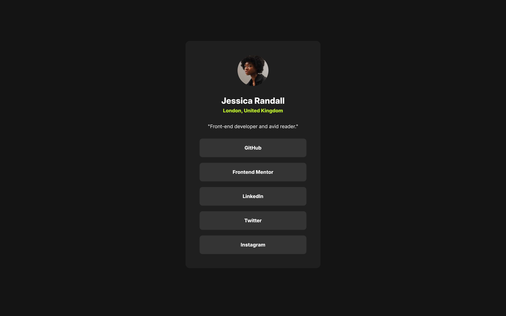

# Frontend Mentor - Social links profile solution

This is a solution to the [Social links profile challenge on Frontend Mentor](https://www.frontendmentor.io/challenges/social-links-profile-UG32l9m6dQ). Frontend Mentor challenges help you improve your coding skills by building realistic projects. 

## Table of contents

- [Overview](#overview)
  - [The challenge](#the-challenge)
  - [Screenshot](#screenshot)
  - [Links](#links)
- [My process](#my-process)
  - [Built with](#built-with)
  - [What I learned](#what-i-learned)
  - [Continued development](#continued-development)
  - [Useful resources](#useful-resources)
- [Author](#author)


## Overview

### The challenge

Users should be able to:

- See hover and focus states for all interactive elements on the page

### Screenshot



### Links

- Solution URL: [Frontendmentor.io solution URL](https://your-solution-url.com)
- Live Site URL: [Vercel live site URL](https://fsdev-social-links-profile.vercel.app/)

## My process

### Built with

- Semantic HTML5 markup
- TailwindCSS
- Flexbox
- Mobile-first workflow
- [React](https://reactjs.org/) - JS library


### What I learned

Use this section to recap over some of your major learnings while working through this project. Writing these out and providing code samples of areas you want to highlight is a great way to reinforce your own knowledge.

How to customize tailwindcss theme and using @utility and @apply directives.


```css
@import url("https://fonts.googleapis.com/css2?family=Inter:ital,opsz,wght@0,14..32,100..900;1,14..32,100..900&display=swap");
@import "tailwindcss";

@theme {
  --color-grey-900: #141414;
  --color-grey-800: #1f1f1f;
  --color-grey-700: #333333;
  --color-green-card: #c4f82a;

  --spacing-500: 40px;
  --spacing-300: 24px;
  --spacing-200: 16px;
  --spacing-150: 12px;
  --spacing-100: 8px;
}


@utility text-preset-1 {
    font-family: "Inter", sans-serif;
    font-weight: 800;
    font-size: 24px;
    line-height: 150%;
    letter-spacing: 0px;
}

@utility text-preset-2-bold {
    font-family: "Inter", sans-serif;
    font-weight: 800;
    font-size: 14px;
    line-height: 150%;
    letter-spacing: 0px;
}

@utility text-preset-2-regular {
    font-family: "Inter", sans-serif;
    font-weight: 400;
    font-size: 14px;
    line-height: 150%;
    letter-spacing: 0px;
}

@utility card-width-mobile {
    width: 327px;
}

@utility card-width-tablet {
    width: 456px;
}

@utility card-width-desktop {
    width: 384px;
}
@utility avatar-size {
    width: 88px;
    height: 88px;
}
@utility containter-padding {
    padding-top: 116.5px;
    padding-bottom: 116.5px;
}

.social-button {
   @apply text-preset-2-bold bg-grey-700 p-4 rounded-lg w-full flex items-center justify-center hover:bg-green-card hover:cursor-pointer hover:text-grey-700;
}
```


If you want more help with writing markdown, we'd recommend checking out [The Markdown Guide](https://www.markdownguide.org/) to learn more.

**Note: Delete this note and the content within this section and replace with your own learnings.**

### Continued development

Use this section to outline areas that you want to continue focusing on in future projects. These could be concepts you're still not completely comfortable with or techniques you found useful that you want to refine and perfect.

### Useful resources

- [TailwindCSS](https://tailwindcss.com/docs/installation/using-vite) - Tailwind CSS documentation

## Author

- Website - [Gustavo Sanchez ](https://gusanchefullstack.dev/)
- Frontend Mentor - [@gusanchefullstack](https://www.frontendmentor.io/profile/gusanchefullstack)
- Twitter - [@gusanchedev](https://x.com/gusanchedev)
- LinkedIn - [@gusanchefullstackdev](https://www.linkedin.com/in/gusanchefullstackdev/)


